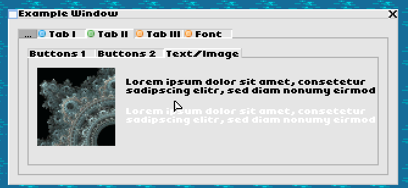
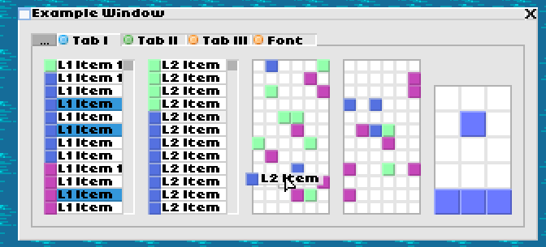

# PixelUI Engine
UI-System on top of LibGDX which provides a tiny 8x8-tile based Window and Component system suited for low-resolution games. 

This library is used in the game [Sandtrix](https://www.sandtrix.net).

## Features
### Screenshots

### Components
- Button
- Checkbox / Radiobox
- Combobox
- Image
- Text
- Inventory (Grid)
- List
- Knob
- Map
- Progressbar
- Scrollbar
- Shapes
- Tabbars & Tabs
- Textfield
- GameViewPort

### Additional features
- ToolTips
- Context Menus
- Notifications
- Modals
- Hotkeys
- List/Inventory drag & drop
- Keyboard mouse control mode
- Gamepad mouse control mode
- Gamepad & Touchscreen text input
- Viewport handling / Pixel-Art upscaling
- Asset-Management
- Input handling
- Particle system
- Settings storage/loading
- Sound player
- Music player
- Utility classes
- High performance, low library size (~370kb)

## Overview
### desktop/ ... /example

Basic example producing the UI in the screenshot above providing a typical setup for the engine.

### core/ ... /engine.media_manager

This asset manager uses assets in the form of an internal CMedia descriptor format.
These assets can then be loaded at once and used/drawn via the MediaManager.

The assets for the UI are contained in GUIBaseMedia and need to be loaded alongside your own assets for the UI to work.

### core/ ... /engine.ui_engine

The core of the Engine. A class implementing the UIAdapter interfaces needs to be created and passed to a new UIEngine object. 

The UIEngine then passes a API Object into the Adapter on init() from which all windows, components can be created.

### Tools

These are not needed for the UI to work.
This package contains classes that integrate seamlessly with the Engine and use the internal formats.

#### core/ ... /engine.tools.game_engine

Provides a basic framework for a game engine with input/output handling.

#### core/ ... /engine.tools.jsonparser

A json parser which supports include files via JSON comments.

#### core/ ... /engine.tools.lthreadpool

Used for iterating over large lists in threads.

#### core/ ... /engine.tools.particles

A particle system using the MediaManager and CMedia graphics formats.

#### core/ ... /engine.tools.settings

A failsafe settings/options manager which supports validation and default values.
Implementations for reading/writing java .properties files are provided.

#### core/ ... /engine.tools.sound.SoundPlayer

A Soundplayer using the MediaManager and CMedia sound format.
This player supports playing sound in a 2D space with automatic volume/pan adjustment.

#### core/ ... /engine.tools.sound.MusicPlayer

A Musicplayer using the MediaManager and CMedia music format.
[This player works like regular player application with playlists, pause/resume etc.

#### core/ ... /engine.tools.transitions.TransitionManager

A tool to create Transition effects when switching between two UIEngine instances

#### core/ ... /engine.tools.Tools]()

Static helper & math functions.
