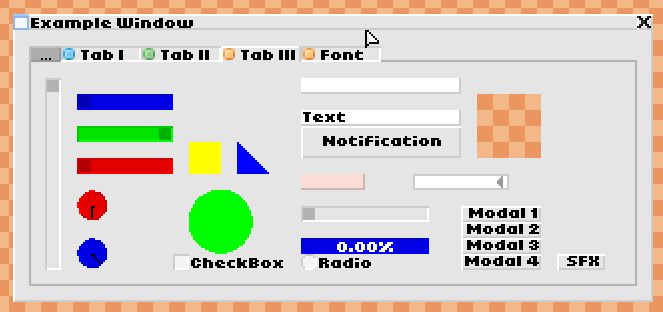
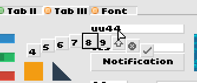

# PixelUI Engine

UI-System on top of LibGDX which provides a tiny 8x8-tile based Window and Component system suited for low-resolution games. 

This library was used in the game [Sandtrix](https://www.sandtrix.net).

## Screenshots

## Features
- Components
  - Button
  - Checkbox / Radiobox
  - Combobox
  - Image
  - Text
  - Inventory (Grid)
  - List
  - Knob
  - Map
  - Progressbar
  - Scrollbar
  - Shapes
  - Tabbars & Tabs
  - Textfield
  - GameViewPort
 - ToolTips
 - Context Menus
 - Notifications
 - Modals
 - Hotkeys
 - Drag & Drop
 - Keyboard & Gamepad mouse emulation
 - Gamepad & Touchscreen text input
 - Viewport handling / Pixel-Art upscaling
 - Asset-Management
 - Input handling
 - High performance, low library size (~370kb)
 - Utility classes
  - Particle system
  - Transition effects
  - Music & Sound players
  - Settings manager

## Overview
### desktop/ ... /example

Basic example producing the UI in the screenshot above providing a typical setup for the engine.

### core/ ... /engine.media_manager

This asset manager uses assets in the form of an internal CMedia descriptor format.
These assets can then be loaded at once and used/drawn via the MediaManager.

The assets for the UI are contained in GUIBaseMedia and need to be loaded alongside your own assets for the UI to work.

### core/ ... /engine.ui_engine

The core of the Engine. A class implementing the UIAdapter interfaces needs to be implemented and passed to a new UIEngine object. 

The UIEngine then passes a API Object into the Adapter on init() from which all windows, components can be created.

### Tools

These are not needed for the UI to work.
This package contains useful classes that integrate seamlessly with the Engine and use the internal formats and classes.

#### core.engine.tools/ ... GameEngine

Provides a basic framework for a game engine which works on data in update cycles. 
Offers input/output handling and uses an adapter approach similar to the UIEngine.

#### core.engine.tools/ ... JsonInlcudeParser

A json parser which supports include files via JSON comments.

#### core.engine.tools/ ... ListThreadUpdater

Used for iterating over large lists by splitting the workload over multiple threads.

#### core.engine.tools/ ... ParticleSystem

A particle system using the MediaManager and CMedia graphics formats. Uses object pooling for performance.

#### core.engine.tools/ ... SettingsManager

A settings/options manager. Has failsafe functionality to ensure that all values are always valid.
A Implementation for reading/writing to java-.properties files is provided via the FileSettingsPersistor, custom storage methods can be implemented.

#### core.engine.tools/ ... SoundPlayer

A Soundplayer that uses the MediaManager and CMedia sound format.
This player supports playing sound in a virtual 2D space with automatic volume/pan adjustment based on distance and direction.

#### core.engine.tools/ ... MusicPlayer

A Musicplayer that uses MediaManager and CMedia music format.
This player works like you would expect it from a regular music player application, which means it supports playlists/shuffle/pause/resume/... etc.

#### core.engine.tools/ ... TransitionManager

A tool to create Transition effects when switching between two UIEngine instances

#### core.engine.tools/ ... Tools

Static helper & math functions.
